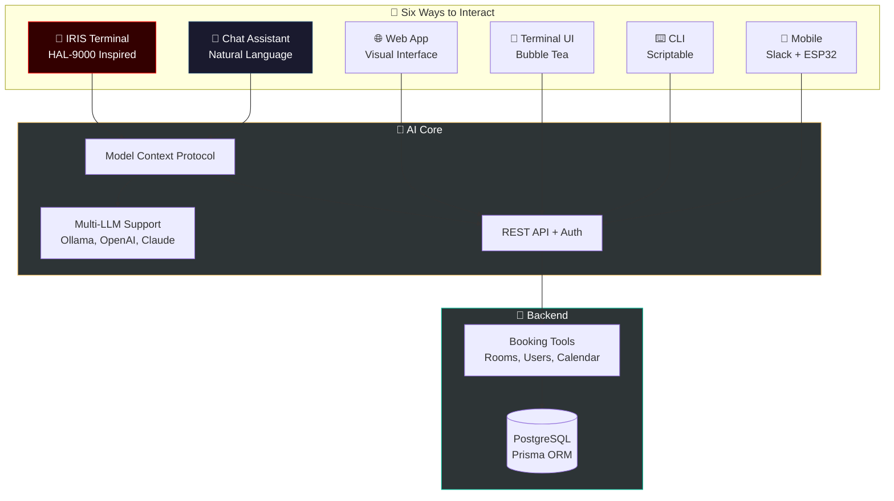

<div align="center">

# 🤖 Miles Assistant

### AI-Powered Workplace Platform

*"Siri har mye på agendaen, så vi introduserer Miles Assistant – intelligent workspace management through multiple interfaces"*

[](https://opensource.org/licenses/MIT)
[](https://nodejs.org/)
[](https://golang.org/)
[](https://modelcontextprotocol.io)

</div>

---

## 🌟 What is Miles Assistant?

Miles Assistant started as a room booking system, but has evolved into a **comprehensive AI-powered workplace platform** with six different interfaces, natural language processing, and intelligent automation. Whether you prefer a HAL-9000 terminal, conversational chat, visual web interface, or scriptable CLI—Miles Assistant adapts to how you work.



---

## 🎯 Choose Your Interface

| Interface | Best For | Technology | Port | Documentation |
|-----------|----------|------------|------|---------------|
| **🔴 IRIS** | Power users who love retro-futuristic terminals | Node.js + HAL-9000 CSS | 3002 | [📖 IRIS Docs](./iris/README.md) |
| **💬 Chat** | Natural conversation and AI assistance | Node.js + Multi-LLM | 3001 | [📖 Chat Docs](./chat-app/README.md) |
| **🌐 Web** | Visual, mobile-friendly experience | React + TypeScript | 5173 | [📖 Web Docs](./web/README.md) |
| **🎨 TUI** | Terminal enthusiasts and keyboard warriors | Go + Bubble Tea | - | [📖 TUI Docs](./tui/README.md) |
| **⌨️ CLI** | Automation, scripting, CI/CD | Go + Cobra | - | [📖 CLI Docs](./cli/README.md) |
| **📱 Mobile** | Slack teams and room displays | Integration Guides | - | [📖 Guides](./docs/) |

---

## ✨ Standout Features

### 🤖 AI-First Design

- **Natural Language Processing**: Talk to your booking system like a colleague
- **Multi-LLM Support**: Choose between Ollama (local), OpenAI, or Anthropic
- **Model Context Protocol**: Standardized AI tool integration across all interfaces
- **Intelligent Suggestions**: AI recommends available times, rooms, and resolves conflicts

### 🎨 Multiple Interfaces

- **IRIS Terminal**: HAL-9000 inspired with CRT scanlines, pulsing red eye, typing animations
- **Chat Assistant**: Modern chat UI with markdown rendering, tables, and streaming responses
- **Web App**: React SPA with shadcn/ui components and dark mode
- **Terminal UI**: Vim keybindings, beautiful TUI built with Bubble Tea
- **CLI**: Fast, scriptable commands for automation
- **Integrations**: Slack bot guide, ESP32 display guide

### 🔒 Type Safety Everywhere

- **OpenAPI-First**: Single source of truth (`api/openapi.yaml`)
- **Generated Clients**: TypeScript and Go types auto-generated
- **End-to-End Safety**: From database to frontend

### 🏢 Enterprise Ready

- **Multi-location**: 7 offices across Norway and Lithuania
- **Role-based Access**: Admin, Manager, User roles
- **Real-time Conflict Detection**: Prevent double-bookings
- **Calendar Integration**: iCal export for Google Calendar, Outlook
- **Feedback System**: Room feedback with resolution workflows

---

## 🚀 Quick Start

### Prerequisites

<details>
<summary><b>What you'll need (click to expand)</b></summary>

**Required:**

- Node.js 20.x or higher
- PostgreSQL (or Docker)

**Optional (depending on interface):**

- Go 1.24.3+ (for TUI/CLI)
- Docker & Docker Compose (for containerized deployment)
- Ollama (for local AI, recommended)

**For AI Features:**
Choose one:

- 🦙 Ollama (local, free, private)
- 🤖 OpenAI API key (ChatGPT)
- 🧠 Anthropic API key (Claude)

</details>

### One-Command Setup

```bash
# Clone and setup everything
git clone <repo-url> miles-assistant
cd miles-assistant
./start-dev.sh
```

**This automatically:**

- ✓ Checks prerequisites (Docker, Ollama)
- ✓ Pulls LLM model if needed
- ✓ Starts PostgreSQL in Docker
- ✓ Runs database migrations and seeding
- ✓ Starts API on port 3000
- ✓ Starts Chat Assistant on port 3001
- ✓ Performs health checks
- ✓ Shows you URLs and credentials

### Access Your Interfaces

After setup completes:

| Interface | URL | Credentials |
|-----------|-----|-------------|
| **API Documentation** | <http://localhost:3000/api-docs> | N/A |
| **Chat Assistant** | <http://localhost:3001> | Login required |
| **IRIS Terminal** | <http://localhost:3002> | Login required |
| **Web App** | <http://localhost:5173> | Login required |

**Test Accounts** (all passwords: `password123`):

- Admin: `admin@miles.com`
- Manager: `manager.stavanger@miles.com`
- User: `john.doe@miles.com`

### Choose Your Adventure

**Want the HAL-9000 experience?**

```bash
cd iris
npm start
# Open http://localhost:3002
```

**Prefer chat?**

```bash
cd chat-app
npm start
# Open http://localhost:3001
```

**Go developer?**

```bash
./install.sh           # Installs TUI and CLI
miles-booking          # Launch TUI
miles login user@mail  # Use CLI
```

**Just want the web UI?**

```bash
cd web
npm install
npm run dev  # http://localhost:5173
```

---

## 📚 Documentation

### Core Documentation

- **[📖 Getting Started Guide](./GETTING_STARTED.md)** - Detailed setup for all components
- **[🏗️ Architecture Overview](./ARCHITECTURE.md)** - System design and data flow
- **[📖 Legacy Booking Docs](./BOOKING_SYSTEM_LEGACY.md)** - Original comprehensive docs

### Interface Documentation

- **[🔴 IRIS](./iris/README.md)** - HAL-9000 terminal assistant
- **[💬 Chat Assistant](./chat-app/README.md)** - AI-powered chat with markdown
- **[🌐 Web App](./web/README.md)** - React frontend
- **[🎨 TUI](./tui/README.md)** - Terminal interface
- **[⌨️ CLI](./cli/README.md)** - Command-line tools

### API & Integration

- **[🔌 API Documentation](./api/README.md)** - REST API reference
- **[🤖 MCP Integration](./api/MCP_README.md)** - Model Context Protocol
- **[📝 OpenAPI Spec](./api/openapi.yaml)** - Interactive docs at `/api-docs`
- **[💬 Slack Bot Guide](./docs/SLACK_BOT_GUIDE.md)** - Slack integration
- **[📺 ESP32 Display Guide](./docs/ESP32_DISPLAY_GUIDE.md)** - Room displays

### Implementation Guides

- **[📋 Feedback System](./FEEDBACK_IMPLEMENTATION_GUIDE.md)** - Room feedback workflows
- **[🛠️ Setup Guide](./SETUP.md)** - Manual setup instructions
- **[⚡ Quick Start](./QUICKSTART.md)** - Fast track setup

---

## 🏗️ Architecture Overview

### Technology Stack

<table>
<tr>
<th>Component</th>
<th>Technology</th>
<th>Purpose</th>
</tr>
<tr>
<td><b>API</b></td>
<td>Node.js, Express, TypeScript, Prisma</td>
<td>Core backend with REST API and MCP server</td>
</tr>
<tr>
<td><b>IRIS</b></td>
<td>Node.js, Express, Vanilla JS</td>
<td>HAL-9000 inspired terminal assistant</td>
</tr>
<tr>
<td><b>Chat</b></td>
<td>Node.js, Express, marked.js</td>
<td>AI chat with markdown rendering</td>
</tr>
<tr>
<td><b>Web</b></td>
<td>React, TypeScript, Vite, shadcn/ui</td>
<td>Modern web application</td>
</tr>
<tr>
<td><b>TUI</b></td>
<td>Go, Bubble Tea, Lipgloss</td>
<td>Beautiful terminal interface</td>
</tr>
<tr>
<td><b>CLI</b></td>
<td>Go, Cobra</td>
<td>Scriptable command-line tool</td>
</tr>
<tr>
<td><b>Database</b></td>
<td>PostgreSQL, Prisma ORM</td>
<td>Persistent data storage</td>
</tr>
<tr>
<td><b>AI Layer</b></td>
<td>Ollama / OpenAI / Anthropic</td>
<td>Natural language processing</td>
</tr>
<tr>
<td><b>Protocol</b></td>
<td>Model Context Protocol (MCP)</td>
<td>Standardized AI tool interface</td>
</tr>
</table>

### Project Structure

```
miles-assistant/
├── api/                    # 🔌 REST API & MCP Server
│   ├── src/
│   │   └── mcp/            # Model Context Protocol tools
│   ├── prisma/             # Database schema & migrations
│   └── openapi.yaml        # OpenAPI specification
│
├── iris/                   # 🔴 HAL-9000 Terminal Assistant
│   ├── public/             # Frontend (HTML/CSS/JS)
│   ├── server.js           # MCP client + LLM integration
│   └── llm-providers.js    # Multi-LLM abstraction
│
├── chat-app/               # 💬 AI Chat Assistant
│   ├── public/             # Frontend with markdown rendering
│   ├── server.js           # Express + MCP + LLM
│   └── llm-providers.js    # Multi-LLM support
│
├── web/                    # 🌐 React Web App
│   ├── src/
│   │   ├── components/     # shadcn/ui components
│   │   ├── lib/api/        # Generated API client
│   │   └── pages/          # App routes
│   └── package.json
│
├── tui/                    # 🎨 Terminal UI (Go)
│   ├── internal/
│   │   ├── generated/      # OpenAPI-generated types
│   │   └── ui/             # Bubble Tea views
│   └── Makefile
│
├── cli/                    # ⌨️ CLI (Go)
│   ├── internal/
│   │   ├── generated/      # OpenAPI-generated types
│   │   └── commands/       # Cobra commands
│   └── Makefile
│
├── docs/                   # 📚 Integration Guides
│   ├── SLACK_BOT_GUIDE.md
│   └── ESP32_DISPLAY_GUIDE.md
│
├── ARCHITECTURE.md         # System architecture deep-dive
├── GETTING_STARTED.md      # Comprehensive setup guide
├── docker-compose.yml      # Container orchestration
├── start-dev.sh            # Development startup script
└── install.sh              # CLI/TUI installer
```

---

## 🎮 Example Workflows

### Natural Language Booking (IRIS or Chat)

```
> I need a room for 6 people tomorrow at 2pm

IRIS: I found Teamrommet which seats 8 people. Would you like
      to book it for 1 hour starting at 2:00 PM?

> yes, make it 2 hours

IRIS: ✓ Booked Teamrommet for 2025-10-21 from 14:00-16:00
```

### CLI Automation

```bash
# Script to book daily standup
#!/bin/bash
miles book \
  --room "Focus Room" \
  --start "$(date +%Y-%m-%d) 09:00" \
  --duration 15 \
  --title "Daily Standup" \
  --recurring weekly
```

### TUI Power User

```
Press 'q' for quick book
Select room with j/k
Press Enter to book
Press '/' to search
```

---

## 🧪 Development

### Start Development Environment

```bash
# Start everything (database, API, chat-app)
./start-dev.sh

# Check status of all services
./status.sh

# View logs (interactive menu)
./logs.sh

# Stop all services
./stop-dev.sh
```

### Individual Component Development

**API:**

```bash
cd api
npm run dev              # Hot reload
npm run prisma:studio    # Database GUI
```

**IRIS:**

```bash
cd iris
npm run dev              # Hot reload (node --watch)
```

**Chat:**

```bash
cd chat-app
npm start
```

**Web:**

```bash
cd web
npm run dev
npm run generate         # Regenerate API client
```

**TUI/CLI:**

```bash
cd tui  # or cd cli
make generate            # Generate types from OpenAPI
make build
make run
```

---

## 🐳 Docker Deployment

**Complete Docker setup with nginx reverse proxy** - [📖 Full Docker Documentation](./README-DOCKER.md)

### One-Command Start

```bash
# Start all services (database, API, chat, IRIS, web, nginx)
docker-compose up -d
```

**Access Everything via Nginx (Port 80):**
- 🌐 Web Frontend: http://localhost/
- 🔌 API: http://localhost/api/
- 💬 Chat: http://localhost/chat/
- 🔴 IRIS: http://localhost/iris/

**Or Direct Service Access:**
- API: http://localhost:3000
- Chat: http://localhost:3001
- IRIS: http://localhost:3002
- Web: http://localhost:3003

### Development with Hot-Reload

```bash
# Use development config with volume mounts
docker-compose -f docker-compose.yml -f docker-compose.dev.yml up

# Or hybrid: Database in Docker, services local
docker-compose up -d postgres
cd api && npm run dev
cd web && npm run dev
```

See [README-DOCKER.md](./README-DOCKER.md) for:
- 📋 Detailed setup instructions
- 🔧 Development workflows
- 🐛 Troubleshooting guide
- 🚀 Production deployment

---

## 🌍 Office Locations

Miles Assistant supports **7 office locations**:

**🇳🇴 Norway**

- Stavanger (5 meeting rooms)
- Haugesund
- Oslo
- Bergen
- Ålesund
- Innlandet (Lillehammer)

**🇱🇹 International**

- Lithuania (Vilnius)

---

## 🤝 Contributing

This is a Miles internal project. For development guidelines, see:

- [Architecture Documentation](./ARCHITECTURE.md)
- [Getting Started Guide](./GETTING_STARTED.md)
- Individual component READMEs

---

## 📄 License

MIT License - see LICENSE file for details

---

<div align="center">

### ⭐ Powered By

[Model Context Protocol](https://modelcontextprotocol.io) • [OpenAPI](https://www.openapis.org/) • [Ollama](https://ollama.com) • [Prisma](https://prisma.io)

---

**Built with ❤️ for Miles**

*From a booking system to a full AI assistant platform*

</div>
