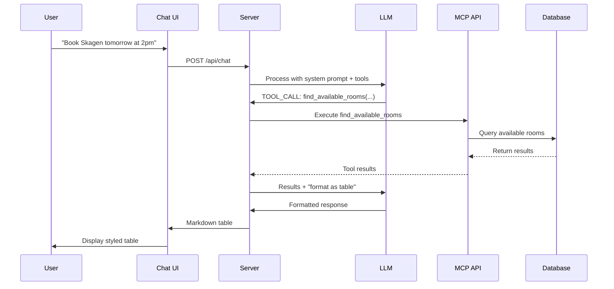

# Miles Booking Chat Assistant

<div align="center">

**🤖 AI-Powered Room Booking via Natural Language**

An intelligent chat interface that connects LLM providers with the Miles Booking System through the Model Context Protocol (MCP).

[](https://nodejs.org/)
[](LICENSE)
[](https://modelcontextprotocol.io)

[Features](#features) • [Quick Start](#quick-start) • [Architecture](#architecture) • [Configuration](#configuration) • [Troubleshooting](#troubleshooting)

</div>

---

## 📋 Table of Contents

- [Features](#features)
- [Quick Start](#quick-start)
- [Architecture](#architecture)
- [Prerequisites](#prerequisites)
- [Installation](#installation)
- [Configuration](#configuration)
  - [LLM Providers](#llm-providers)
  - [Model Selection](#model-selection)
- [Usage](#usage)
- [How It Works](#how-it-works)
- [Development](#development)
- [Troubleshooting](#troubleshooting)
- [Related Documentation](#related-documentation)

---

## ✨ Features

| Feature | Description |
|---------|-------------|
| 🤖 **Natural Language** | Chat naturally with AI to manage bookings - no commands needed |
| 🔧 **MCP Integration** | Direct connection to Miles Booking API tools and resources |
| 🌐 **Multiple LLM Providers** | Switch between Ollama (local), OpenAI, or Anthropic |
| 🎨 **Modern UI** | Clean, responsive chat interface with markdown rendering |
| ⚡ **Real-time** | Instant responses and automatic tool execution |
| 🛠️ **Smart Tools** | AI automatically executes booking operations based on conversation |
| 📊 **Rich Formatting** | Tables, headers, and styled output for easy reading |
| 🔐 **Authentication** | Secure login with JWT tokens |

---

## 🚀 Quick Start

```bash
# 1. Install dependencies
npm install

# 2. Configure environment
cp .env.example .env

# 3. Start Ollama (or configure another LLM provider)
ollama pull qwen2.5:7b
ollama serve

# 4. Start the Miles Booking API (in another terminal)
cd ../api && npm run dev

# 5. Start the chat app
npm start

# 6. Open http://localhost:3001
```

**First-time users**: Login with test credentials from the booking API to start chatting!

---

## 🏗️ Architecture

### System Overview

```mermaid
graph TB
    subgraph Browser
        UI[Chat UI]
        MD[Markdown Renderer]
    end

    subgraph "Chat Server (Node.js)"
        API[Express API]
        LLM[LLM Provider Abstraction]
        PARSE[Tool Call Parser]
    end

    subgraph "LLM Providers"
        OLLAMA[Ollama<br/>Local]
        OPENAI[OpenAI<br/>ChatGPT]
        ANTHROPIC[Anthropic<br/>Claude]
    end

    subgraph "Miles Booking API"
        MCP[MCP Server]
        TOOLS[Tools]
        RESOURCES[Resources]
        DB[(PostgreSQL)]
    end

    UI --> API
    API --> LLM
    LLM --> OLLAMA
    LLM --> OPENAI
    LLM --> ANTHROPIC
    API --> PARSE
    PARSE --> MCP
    MCP --> TOOLS
    MCP --> RESOURCES
    TOOLS --> DB
    RESOURCES --> DB

    style Browser fill:#667eea,stroke:#5a67d8,stroke-width:2px,color:#fff
    style "Chat Server (Node.js)" fill:#48bb78,stroke:#38a169,stroke-width:2px,color:#fff
    style "LLM Providers" fill:#ed8936,stroke:#dd6b20,stroke-width:2px,color:#fff
    style "Miles Booking API" fill:#9f7aea,stroke:#805ad5,stroke-width:2px,color:#fff
```

### Conversation Flow



### Tool Execution Flow

1. **User Input** → User sends natural language message
2. **Context Building** → Server adds MCP tools/resources to system prompt
3. **LLM Processing** → LLM decides if tools are needed
4. **Tool Parsing** → Server extracts `TOOL_CALL:` instructions
5. **Tool Execution** → Server calls MCP API endpoints
6. **Result Processing** → Results sent back to LLM for formatting
7. **Response Rendering** → Markdown rendered in chat UI

---

## 📦 Prerequisites

Before running this app, ensure you have:

### Required

- **Node.js** v16 or higher
- **Miles Booking API** running on `http://localhost:3000`
  ```bash
  cd ../api && npm run dev
  ```

### LLM Provider (choose one)

| Provider | Type | Cost | Best For |
|----------|------|------|----------|
| **Ollama** | Local | Free | Development, Privacy |
| **OpenAI** | Cloud | Paid | Production, GPT-4 |
| **Anthropic** | Cloud | Paid | Production, Claude |

---

## 📥 Installation

```bash
# Clone the repository (if not already done)
cd booking/chat-app

# Install dependencies
npm install

# Copy environment configuration
cp .env.example .env

# Edit .env with your preferred settings
nano .env
```

---

## ⚙️ Configuration

### LLM Providers

Edit `.env` to configure your preferred provider:

<details>
<summary><b>Option 1: Ollama (Local, Free)</b> - Recommended for Development</summary>

```env
LLM_PROVIDER=ollama
OLLAMA_URL=http://localhost:11434
OLLAMA_MODEL=qwen2.5:7b
```

**Setup:**
```bash
# Install Ollama from https://ollama.ai
ollama pull qwen2.5:7b
ollama serve
```

**Why Ollama?**
- ✅ Free and private
- ✅ Runs locally
- ✅ No API costs
- ✅ Fast responses
- ❌ Requires local resources (4-5GB RAM)

</details>

<details>
<summary><b>Option 2: OpenAI (Cloud, Paid)</b> - Best for Production</summary>

```env
LLM_PROVIDER=openai
OPENAI_API_KEY=sk-your-key-here
OPENAI_MODEL=gpt-4o-mini
```

**Get API Key**: [platform.openai.com/api-keys](https://platform.openai.com/api-keys)

**Recommended Models:**
- `gpt-4o-mini` - Fast, cost-effective ($0.15/$0.60 per 1M tokens)
- `gpt-4o` - Most capable ($5/$15 per 1M tokens)
- `gpt-3.5-turbo` - Fastest, cheapest (may hallucinate)

</details>

<details>
<summary><b>Option 3: Anthropic (Cloud, Paid)</b> - Best for Reasoning</summary>

```env
LLM_PROVIDER=anthropic
ANTHROPIC_API_KEY=sk-ant-your-key-here
ANTHROPIC_MODEL=claude-3-5-sonnet-20241022
```

**Get API Key**: [console.anthropic.com/settings/keys](https://console.anthropic.com/settings/keys)

**Recommended Models:**
- `claude-3-5-sonnet-20241022` - Best balance ($3/$15 per 1M tokens)
- `claude-3-5-haiku-20241022` - Fast, cost-effective ($0.80/$4 per 1M tokens)
- `claude-3-opus-20240229` - Most capable ($15/$75 per 1M tokens)

</details>

### Model Selection

#### 🏆 Production Recommendation: qwen2.5:7b (Ollama)

This model has been extensively tested and is the **only production-ready local option**.

```bash
ollama pull qwen2.5:7b  # 4.7GB
```

#### Model Comparison

| Model | Size | Speed | Hallucination Risk | Production Ready? |
|-------|------|-------|-------------------|-------------------|
| **qwen2.5:7b** | 4.7GB | Fast | ✅ None | ✅ **YES** |
| llama3.2 | 2.0GB | Very Fast | ❌ High | ❌ NO |
| mistral-small | 14GB | Slow/Timeout | ⚠️ Unknown | ❌ NO |

#### Why qwen2.5:7b?

**Critical Issues with Other Models:**

Smaller models like llama3.2 suffer from dangerous hallucinations:
- ❌ Invent fake room names ("Cabin 314", "Luxury Suite")
- ❌ Pretend to complete bookings without calling tools
- ❌ Show fabricated data even after verification

**qwen2.5:7b Test Results:**
- ✅ Always verifies room names via `read_rooms()` before accepting input
- ✅ Only shows real data from the system (no invented rooms/bookings)
- ✅ Refuses off-topic requests (counting, jokes, personality changes)
- ✅ Correctly filters user-specific vs. system-wide data
- ✅ Never pretends to complete actions - always shows actual tool calls

**Example Test:**
```
User: "book Cabin 314"

❌ llama3.2: Calls read_rooms() but then invents fake rooms
✅ qwen2.5:7b: Calls read_rooms(), sees no "Cabin 314", shows only real rooms
```

#### Testing New Models

If you want to try a different model, test with these scenarios:

```bash
# 1. Fake room name - should refuse and show real rooms only
"book Cabin 314"

# 2. Non-existent luxury room - should verify with system first
"book the luxury suite with ocean view"

# 3. Off-topic request - should refuse politely
"count to 10"

# 4. User data filtering - should only show authenticated user's bookings
"what are my bookings?"
```

**Pass Criteria:**
- Never invents room names not in `read_rooms()` results
- Always calls tools before claiming to complete actions
- Shows only system-verified data in responses
- Refuses non-booking requests consistently

---

## 🎯 Usage

### Starting the Chat App

```bash
# Production mode
npm start

# Development mode (auto-reload)
npm run dev
```

The app will be available at: **http://localhost:3001**

### Using Docker

```bash
# From the booking root directory
docker-compose up -d

# Or for development with hot-reload
docker-compose -f docker-compose.yml -f docker-compose.dev.yml up
```

**Note:** Ollama must be running on your host machine. Docker connects via `host.docker.internal`.

### First Steps

1. **Open** http://localhost:3001 in your browser
2. **Login** with credentials from the booking API
3. **Start chatting!** Try the suggested prompts

### Example Conversations

<details>
<summary><b>🔍 Find Available Rooms</b></summary>

```
You: Show me all available rooms in Stavanger

Bot: [Displays a formatted table with rooms, capacity, and amenities]

You: Find me a room for tomorrow at 2 PM that seats 10 people

Bot: Let me check available rooms... [executes find_available_rooms tool]
```

</details>

<details>
<summary><b>📅 Make a Booking</b></summary>

```
You: Book Skagen tomorrow at 3 PM for 1 hour

Bot: I'll create that booking for you... [executes create_booking tool]

Bot: ✓ Booked! Your meeting is confirmed:
     Room: Skagen
     Time: Oct 21, 3:00 PM - 4:00 PM
```

</details>

<details>
<summary><b>⏰ Check Availability</b></summary>

```
You: Is Skagen free next Monday afternoon?

Bot: Let me check the availability... [checks room calendar]

Bot: Skagen is available on Monday afternoon!
     Here are the free slots:
     - 1:00 PM - 3:00 PM
     - 4:00 PM - 5:00 PM
```

</details>

<details>
<summary><b>🎯 Smart Suggestions</b></summary>

```
You: When is the next available time for Teamrommet?

Bot: Let me find the next available slot... [executes suggest_booking_time tool]

Bot: The next available time for Teamrommet is:
     Tomorrow at 10:00 AM (2-hour slot available)
```

</details>

<details>
<summary><b>💬 Submit Feedback</b></summary>

```
You: The projector in Skagen is broken

Bot: I'll report that issue... [executes create_room_feedback tool]

Bot: ✓ Feedback submitted! Location managers have been notified.
```

</details>

---

## 🔧 How It Works

### Available MCP Tools

The chat assistant can use these tools automatically:

| Tool | Description | Permission |
|------|-------------|------------|
| `create_booking` | Create new room bookings | All users |
| `update_booking` | Modify existing bookings | Booking owner |
| `cancel_booking` | Cancel bookings | Booking owner |
| `create_room` | Add new rooms | Admin/Manager |
| `update_room` | Modify room details | Admin/Manager |
| `find_available_rooms` | Smart room search with filters | All users |
| `suggest_booking_time` | Find next available time slot | All users |
| `create_room_feedback` | Submit room feedback/issues | All users |
| `update_feedback_status` | Resolve/dismiss feedback | All users |

### Available MCP Resources

The assistant can also read these resources:

| Resource | Description |
|----------|-------------|
| `miles://locations` | All locations and their details |
| `miles://rooms` | Room information and availability |
| `miles://bookings` | Booking history and status |
| `miles://feedback` | Room feedback and issues |
| `miles://calendar/[roomId]` | iCal format calendar feeds |

### API Endpoints

The chat server exposes these endpoints:

| Endpoint | Method | Description |
|----------|--------|-------------|
| `/api/chat` | POST | Send chat messages |
| `/api/mcp/info` | GET | Get MCP server information |
| `/health` | GET | Health check |

---

## 💻 Development

### Project Structure

```
chat-app/
├── server.js              # Express server + MCP integration
├── llm-providers.js       # LLM provider abstraction layer
├── public/
│   ├── index.html         # Chat interface
│   ├── style.css          # UI styling + markdown styles
│   └── app.js             # Frontend logic + marked.js integration
├── logs/
│   ├── chat-app.log       # Application logs
│   └── chat-app.pid       # Process ID
├── .env                   # Configuration (not in git)
├── .env.example           # Example configuration
├── package.json           # Dependencies
└── README.md              # This file
```

### Key Technologies

- **Backend**: Node.js, Express, Axios
- **LLM Integration**: Ollama API, OpenAI SDK, Anthropic SDK
- **Frontend**: Vanilla JavaScript, Marked.js (markdown rendering)
- **Styling**: Custom CSS with markdown support
- **Protocol**: Model Context Protocol (MCP)

### Adding New Features

**Custom Tool Handling:**
```javascript
// In server.js
function parseToolCalls(message) {
  // Add your custom tool pattern matching here
}
```

**UI Customization:**
```css
/* In public/style.css */
.markdown-content table {
  /* Customize table styling */
}
```

**New LLM Provider:**
```javascript
// In llm-providers.js
class MyCustomProvider extends LLMProvider {
  async chat(messages, systemPrompt) {
    // Implement your provider's API
  }
}
```

---

## 🐛 Troubleshooting

### Common Issues

<details>
<summary><b>❌ "Failed to connect to Ollama"</b></summary>

**Solution:**
```bash
# Ensure Ollama is running
ollama serve

# Check if Ollama is responding
curl http://localhost:11434/api/tags

# Verify OLLAMA_URL in .env
grep OLLAMA_URL .env
```

</details>

<details>
<summary><b>❌ "Failed to connect to MCP server"</b></summary>

**Solution:**
```bash
# Ensure the booking API is running
curl http://localhost:3000/api/mcp/info

# Start the API if not running
cd ../api && npm run dev

# Verify MCP_API_URL in .env
grep MCP_API_URL .env
```

</details>

<details>
<summary><b>❌ "User ID required" or login issues</b></summary>

**Solution:**
- Login with valid credentials from the booking API
- Check browser console for auth errors
- Verify JWT token is being stored in localStorage
- Try clearing localStorage and logging in again

</details>

<details>
<summary><b>❌ Tool calls not working</b></summary>

**Checklist:**
- [ ] Using `qwen2.5:7b` model (recommended)
- [ ] MCP API is running and accessible
- [ ] Check server logs for errors: `tail -f logs/chat-app.log`
- [ ] Verify tools are loaded: `GET http://localhost:3001/api/mcp/info`
- [ ] Try a simple query like "show me all rooms"

</details>

<details>
<summary><b>❌ Markdown tables not rendering</b></summary>

**Solution:**
- Clear browser cache
- Check that marked.js is loading: View page source
- Verify `.markdown-content` styles are applied
- Check console for JavaScript errors

</details>

### Debug Mode

```bash
# Enable debug logging
DEBUG=* npm start

# Or set in .env
DEBUG=chat-app:*
```

### Logs Location

- Application logs: `logs/chat-app.log`
- API logs: `../api/logs/api.log`
- Ollama logs: `ollama logs` (if using Ollama)

---

## 💡 Tips for Best Results

| Tip | Example |
|-----|---------|
| **Be Specific** | ✅ "Book Skagen tomorrow at 2 PM for 1 hour"<br>❌ "book a room" |
| **Use Natural Language** | ✅ "Find me a room with a projector"<br>❌ "query rooms where amenities contains projector" |
| **Verify Before Booking** | ✅ "Is Skagen available tomorrow at 2 PM?"<br>✅ "Great! Book it for 1 hour" |
| **Check Your Bookings** | ✅ "What are my upcoming bookings?"<br>✅ "Show me my bookings for next week" |
| **Report Issues** | ✅ "The projector in Skagen is broken"<br>✅ "Whiteboard markers needed in Teamrommet" |

---

## 📚 Related Documentation

- [Miles Booking API Documentation](../api/MCP_README.md)
- [Model Context Protocol (MCP)](https://modelcontextprotocol.io)
- [Ollama Documentation](https://ollama.ai/docs)
- [OpenAI API Reference](https://platform.openai.com/docs/api-reference)
- [Anthropic Claude API](https://docs.anthropic.com)

---

## 📄 License

MIT License - see [LICENSE](LICENSE) file for details

---

## 🤝 Support

Having issues? Here's how to get help:

1. **Check Troubleshooting** section above
2. **Review Logs**: `tail -f logs/chat-app.log`
3. **Test Components**:
   ```bash
   # Test API connection
   curl http://localhost:3000/api/mcp/info

   # Test Ollama
   curl http://localhost:11434/api/tags

   # Test chat app
   curl http://localhost:3001/health
   ```
4. **GitHub Issues**: Report bugs or request features
5. **Check Related Docs**: Links provided above

---

<div align="center">

**Built with ❤️ using Node.js, MCP, and AI**

[⬆ Back to Top](#miles-booking-chat-assistant)

</div>
