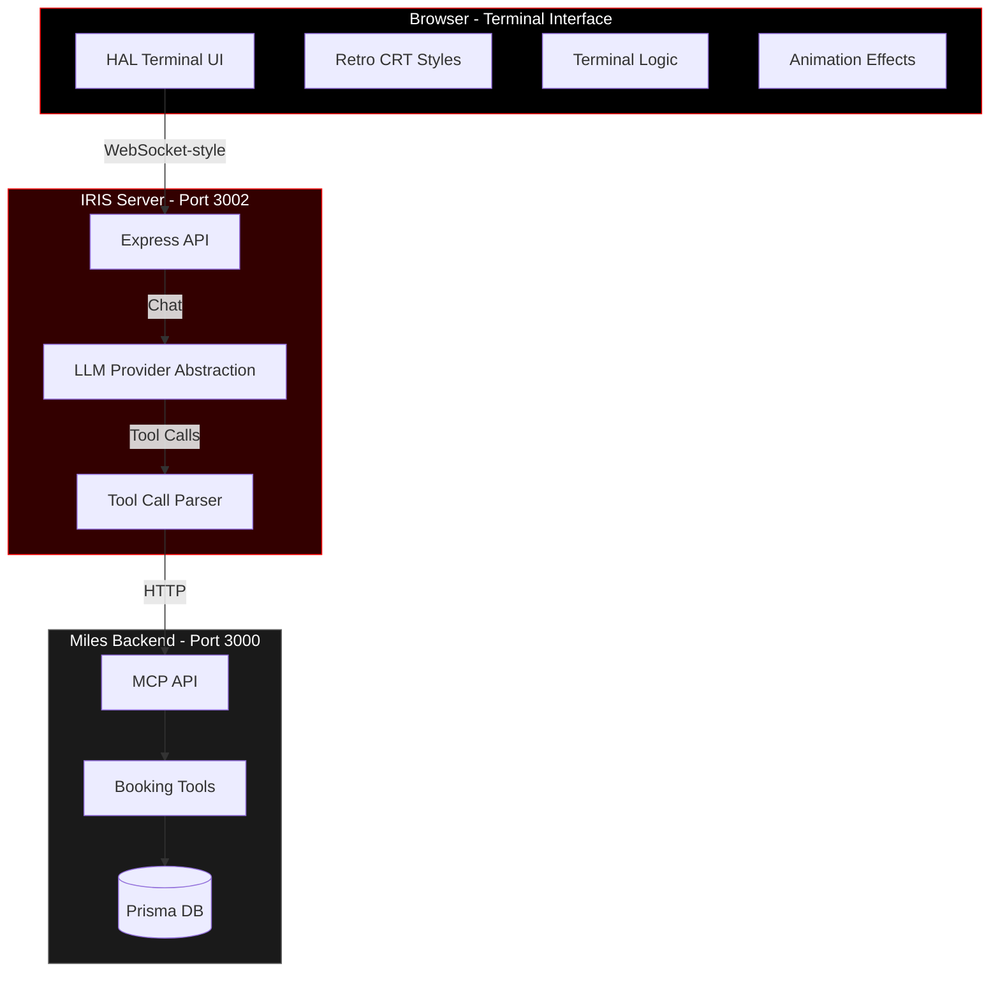

<div align="center">

# 🔴 IRIS

### Miles' Retro-Futuristic AI Assistant

**I**ntelligent **R**oom **I**nteraction **S**ystem

*"Siri har mye på agendaen, så vi introduserer IRIS – Miles sin egen AI-assistent som kan filtrere bort alle de spørsmålene du kunne funnet ut av selv."*

[](https://opensource.org/licenses/MIT)
[](https://nodejs.org/)
[](https://en.wikipedia.org/wiki/HAL_9000)

</div>

---

## 🎬 Overview

IRIS is a HAL-9000 inspired terminal interface for the Miles booking system. It combines retro-futuristic aesthetics with modern AI capabilities, providing a unique command-line experience for managing room bookings and system inquiries.

<div align="center">

```
╔═══════════════════════════════════════════════════════╗
║                                                       ║
║   ██╗██████╗ ██╗███████╗                            ║
║   ██║██╔══██╗██║██╔════╝                            ║
║   ██║██████╔╝██║███████╗                            ║
║   ██║██╔══██╗██║╚════██║                            ║
║   ██║██║  ██║██║███████║                            ║
║   ╚═╝╚═╝  ╚═╝╚═╝╚══════╝                            ║
║                                                       ║
║           MILES AI ASSISTANT v1.0                     ║
║                                                       ║
╚═══════════════════════════════════════════════════════╝
```

</div>

## ✨ Features

### 🎨 Visual Effects
- **HAL-9000 Red Eye**: Animated, pulsing red eye that "thinks" during processing
- **CRT Scanlines**: Authentic cathode ray tube screen effect
- **Terminal Glow**: Retro phosphor screen green/red glow effects
- **Glitch Effects**: Occasional screen artifacts for authenticity
- **Typing Animation**: Character-by-character text output
- **Command History**: Arrow key navigation through previous commands

### 🤖 AI Capabilities
- **Natural Language Processing**: Chat naturally, no strict command syntax
- **Multi-LLM Support**:
  - 🦙 Ollama (local, privacy-first)
  - 🤖 OpenAI (ChatGPT)
  - 🧠 Anthropic (Claude)
- **Context-Aware**: Understands booking system context and user permissions
- **Tool Integration**: Direct access to Miles MCP booking tools

### 🏢 Booking Features
- View available rooms with capacity and amenities
- Create and manage bookings
- Check room availability
- Submit and view feedback
- View all system bookings (manager/admin)
- Cancel bookings with confirmation

---

## 🏗️ Architecture



---

## 🚀 Quick Start

### Prerequisites

- Node.js 20.x or higher
- Miles Booking API running on `http://localhost:3000`
- One of the following LLM providers:
  - Ollama (recommended for local/private deployment)
  - OpenAI API key
  - Anthropic API key

### Installation

1. **Clone and navigate:**
   ```bash
   cd /path/to/miles/booking/iris
   ```

2. **Install dependencies:**
   ```bash
   npm install
   ```

3. **Configure environment:**
   ```bash
   cp .env.example .env
   nano .env  # Edit configuration
   ```

4. **Start IRIS:**
   ```bash
   npm start
   ```

5. **Access terminal:**
   Open `http://localhost:3002` in your browser

---

## ⚙️ Configuration

### Environment Variables

```bash
# IRIS Server Configuration
PORT=3002

# Miles Booking API
MCP_API_URL=http://localhost:3000/api/mcp

# LLM Provider (ollama, openai, or anthropic)
LLM_PROVIDER=ollama

# Ollama Configuration (Local LLM)
OLLAMA_URL=http://localhost:11434
OLLAMA_MODEL=qwen2.5:7b

# OpenAI Configuration
OPENAI_API_KEY=sk-...
OPENAI_MODEL=gpt-4o-mini

# Anthropic Configuration
ANTHROPIC_API_KEY=sk-ant-...
ANTHROPIC_MODEL=claude-3-5-sonnet-20241022
```

### Choosing an LLM Provider

<details>
<summary><b>🦙 Ollama (Recommended)</b></summary>

**Pros:**
- 🔒 Privacy-first (runs locally)
- 💰 Free (no API costs)
- ⚡ Fast responses
- 🌐 Works offline

**Setup:**
```bash
# Install Ollama
curl -fsSL https://ollama.com/install.sh | sh

# Pull model
ollama pull qwen2.5:7b

# Verify it's running
ollama list
```

**Configuration:**
```bash
LLM_PROVIDER=ollama
OLLAMA_URL=http://localhost:11434
OLLAMA_MODEL=qwen2.5:7b
```

</details>

<details>
<summary><b>🤖 OpenAI (ChatGPT)</b></summary>

**Pros:**
- 🎯 Highly accurate
- 🌍 No local setup needed
- 📈 Constantly improving

**Cons:**
- 💵 API costs per token
- ☁️ Requires internet
- 📊 Data sent to OpenAI

**Configuration:**
```bash
LLM_PROVIDER=openai
OPENAI_API_KEY=sk-...
OPENAI_MODEL=gpt-4o-mini  # or gpt-4, gpt-4-turbo
```

</details>

<details>
<summary><b>🧠 Anthropic (Claude)</b></summary>

**Pros:**
- 🎓 Excellent reasoning
- 📝 Great with complex queries
- 🛡️ Strong safety features

**Cons:**
- 💵 API costs per token
- ☁️ Requires internet

**Configuration:**
```bash
LLM_PROVIDER=anthropic
ANTHROPIC_API_KEY=sk-ant-...
ANTHROPIC_MODEL=claude-3-5-sonnet-20241022
```

</details>

---

## 🎮 Usage

### Login

Use your Miles booking system credentials:
```
Email:    john.doe@miles.com
Password: ********
```

### Built-in Commands

| Command | Description |
|---------|-------------|
| `help` | Show available commands |
| `clear`, `cls` | Clear terminal output |
| `status` | Show system status and user info |
| `about`, `info` | About IRIS |
| `rooms` | List all available rooms |
| `bookings` | Show your bookings |

### Natural Language Examples

IRIS understands natural language. Try:

```
> Show me available rooms tomorrow at 2pm

> Book the Focus Room for 1 hour starting at 3pm today

> What's the capacity of Teamrommet?

> Cancel my booking in the Innovation Lab

> Show all bookings for next week

> I need a room with a TV for 6 people
```

### HAL Personality

IRIS adopts a calm, precise HAL-9000 inspired personality:

```
> book a room that doesn't exist
IRIS: I'm sorry, but I cannot locate that room in our system.
      The available rooms are: Teamrommet, Focus Room, Innovation Lab.
      Would you like to book one of these instead?
```

---

## 🎨 Terminal Features

### Command History
- **↑ Up Arrow**: Previous command
- **↓ Down Arrow**: Next command
- Scrolls through your command history

### Visual States

#### Idle State
```
HAL eye pulses gently
Status: "IRIS v1.0 - ONLINE"
```

#### Thinking State
```
HAL eye pulses rapidly
Status: "PROCESSING..."
Typing indicator shows three animated dots
```

#### Error State
```
Red error message
Optional screen shake or glitch effect
```

---

## 🔧 Development

### Project Structure

```
iris/
├── server.js              # Main Express server
├── llm-providers.js       # LLM abstraction layer
├── package.json           # Dependencies
├── .env                   # Configuration
├── .env.example          # Configuration template
├── README.md             # This file
└── public/
    ├── index.html        # Terminal UI structure
    ├── terminal.css      # HAL-9000 styling
    ├── terminal.js       # Terminal logic & commands
    └── animations.js     # Visual effects
```

### Running in Development

```bash
# Auto-restart on changes
npm run dev

# Production mode
npm start
```

### Adding Custom Commands

Edit `public/terminal.js` in the `processCommand` function:

```javascript
if (cmd === 'mycommand') {
    stopThinking();
    addOutput('My custom output', 'system-output');
    return;
}
```

---

## 🐛 Troubleshooting

<details>
<summary><b>IRIS won't start</b></summary>

Check dependencies:
```bash
npm install
```

Verify Node version:
```bash
node --version  # Should be 20.x or higher
```

</details>

<details>
<summary><b>Cannot connect to booking system</b></summary>

Ensure the Miles API is running:
```bash
# In the api directory
npm start
```

Verify MCP_API_URL in `.env`:
```bash
MCP_API_URL=http://localhost:3000/api/mcp
```

</details>

<details>
<summary><b>Ollama connection error</b></summary>

Check Ollama is running:
```bash
ollama list
```

Verify model is downloaded:
```bash
ollama pull qwen2.5:7b
```

Check OLLAMA_URL in `.env`:
```bash
OLLAMA_URL=http://localhost:11434
```

</details>

<details>
<summary><b>LLM not responding correctly</b></summary>

Try a different model:
```bash
# For Ollama
ollama pull llama3.1:8b

# Update .env
OLLAMA_MODEL=llama3.1:8b
```

Or switch providers:
```bash
LLM_PROVIDER=openai  # or anthropic
```

</details>

<details>
<summary><b>Login fails</b></summary>

Verify credentials match your Miles account.

Check browser console (F12) for errors.

Ensure authentication token is valid:
```javascript
// In browser console
localStorage.getItem('irisAuthToken')
```

</details>

---

## 🎯 API Reference

### Health Check
```http
GET /health

Response:
{
  "status": "operational",
  "service": "IRIS",
  "version": "1.0",
  "timestamp": "2025-10-20T15:32:09.821Z",
  "llmProvider": "ollama",
  "model": "qwen2.5:7b"
}
```

### Process Command
```http
POST /api/command
Authorization: Bearer <token>
Content-Type: application/json

{
  "command": "show me available rooms",
  "userId": "user-id"
}

Response:
{
  "response": "Here are the available rooms:\n\n| Room | Capacity |..."
}
```

---

## 🎭 Design Philosophy

IRIS embodies the HAL-9000 aesthetic from *2001: A Space Odyssey*:

- **Calm Authority**: Professional, measured responses
- **Understated Power**: Sophisticated without being flashy
- **Red Monochrome**: Iconic HAL red color scheme
- **Retro-Futurism**: 1960s vision of the future meets modern AI
- **Terminal Interface**: Command-line nostalgia with modern UX

### Color Palette

```css
--hal-red:          #ff0000   /* Primary red */
--hal-red-glow:     rgba(255, 0, 0, 0.8)
--hal-dark:         #0a0a0a   /* Deep black */
--terminal-bg:      #000000   /* Pure black background */
--terminal-text:    #ff0000   /* Red text */
--terminal-text-dim: #880000  /* Dim red for secondary text */
```

---

## 📜 License

MIT License - see LICENSE file for details

---

## 🙏 Credits

- Inspired by HAL-9000 from *2001: A Space Odyssey*
- Built for Miles booking system
- Powered by [Model Context Protocol (MCP)](https://modelcontextprotocol.io)

---

<div align="center">

**"I'm sorry Dave, I'm afraid I can't do that."**

*Just kidding. IRIS is here to help!*

---

Made with ❤️ (and a lot of red) by the Miles team

</div>
