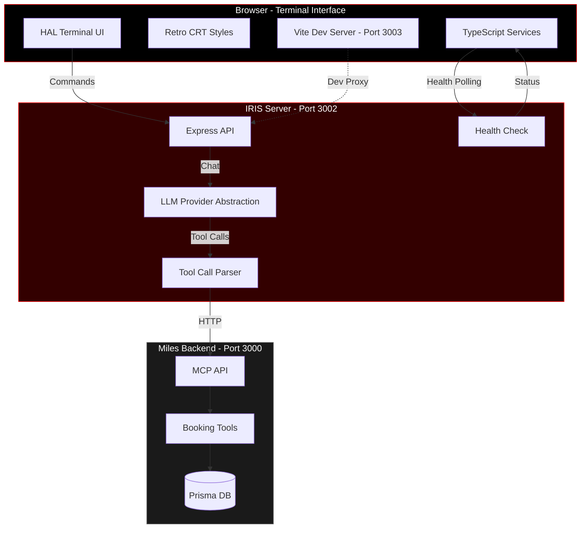

<div align="center">

# 🔴 IRIS

### Miles' Retro-Futuristic AI Assistant

**I**ntelligent **R**esource and **I**nformation **S**ystem

*"IRIS – Intelligent Resource and Information System. Miles' retro-futuristic AI assistant for room booking and resource management."*

[](https://opensource.org/licenses/MIT)
[](https://nodejs.org/)
[](https://en.wikipedia.org/wiki/HAL_9000)

</div>

---

## 🎬 Overview

IRIS is a HAL-9000 inspired terminal interface for the Miles booking system. It combines retro-futuristic aesthetics with modern AI capabilities, providing a unique command-line experience for managing room bookings and system inquiries.

<div align="center">

```
╔═══════════════════════════════════════════════════════╗
║                                                       ║
║   ██╗██████╗ ██╗███████╗                            ║
║   ██║██╔══██╗██║██╔════╝                            ║
║   ██║██████╔╝██║███████╗                            ║
║   ██║██╔══██╗██║╚════██║                            ║
║   ██║██║  ██║██║███████║                            ║
║   ╚═╝╚═╝  ╚═╝╚═╝╚══════╝                            ║
║                                                       ║
║           MILES AI ASSISTANT v1.0                     ║
║                                                       ║
╚═══════════════════════════════════════════════════════╝
```

</div>

## ✨ Features

### 🎨 Visual Effects
- **HAL-9000 Red Eye**: Animated, pulsing red eye that "thinks" during processing
- **LLM Connection Indicator**: Eye shows power state - bright/pulsing when LLM is connected, dimmed when disconnected
- **CRT Scanlines**: Authentic cathode ray tube screen effect
- **Terminal Glow**: Retro phosphor screen green/red glow effects
- **Glitch Effects**: Occasional screen artifacts for authenticity
- **Typing Animation**: Character-by-character text output
- **Command History**: Arrow key navigation through previous commands

### 🤖 AI Capabilities
- **Natural Language Processing**: Chat naturally, no strict command syntax
- **Multi-LLM Support**:
  - 🦙 Ollama (local, privacy-first)
  - 🤖 OpenAI (ChatGPT)
  - 🧠 Anthropic (Claude)
- **Conversational Context**: IRIS remembers your last 10 interactions for 30 minutes, allowing natural follow-up commands
- **Contextual References**: Use phrases like "book it", "that room", "same time" after checking availability
- **System Context**: Understands booking system context and user permissions
- **Tool Integration**: Direct access to Miles MCP booking tools
- **Interaction Logging**: SQLite database logs all interactions for troubleshooting

### 🏢 Booking Features
- View available rooms with capacity and amenities
- Create and manage bookings
- Check room availability
- Submit and view feedback
- View all system bookings (manager/admin)
- Cancel bookings with confirmation

---

## 🏗️ Architecture



### Tech Stack

- **Frontend**: TypeScript + Vite (hot-reload development)
- **Backend**: Node.js + Express
- **LLM Integration**: Multi-provider abstraction (Ollama/OpenAI/Anthropic)
- **Database**: SQLite (interaction logging)
- **Testing**: Playwright (30 E2E tests)

---

## 🚀 Quick Start

### Prerequisites

- Node.js 20.x or higher
- Miles Booking API running on `http://localhost:3000`
- One of the following LLM providers:
  - Ollama (recommended for local/private deployment)
  - OpenAI API key
  - Anthropic API key

### Option 1: Development Mode (with hot-reload)

1. **Clone and navigate:**
   ```bash
   cd /path/to/miles/booking/iris
   ```

2. **Install dependencies:**
   ```bash
   npm install
   ```

3. **Configure environment:**
   ```bash
   cp .env.example .env
   nano .env  # Edit configuration
   ```

4. **Build TypeScript:**
   ```bash
   npm run build
   ```

5. **Start backend server (Terminal 1):**
   ```bash
   npm run dev:server
   ```
   Express server starts on `http://localhost:3002`

6. **Start Vite dev server (Terminal 2):**
   ```bash
   npm run dev
   ```
   Vite opens browser at `http://localhost:3003` with hot-reload

### Option 2: Production Mode

1. **Build and start:**
   ```bash
   npm run build
   npm start
   ```

2. **Access terminal:**
   Open `http://localhost:3002` in your browser

### Option 3: Docker (Recommended for Production)

1. **Using Docker Compose:**
   ```bash
   docker-compose up -d
   ```

2. **Or build and run manually:**
   ```bash
   docker build -t miles-iris .
   docker run -p 3002:3002 --env-file .env miles-iris
   ```

3. **Access terminal:**
   Open `http://localhost:3002` in your browser

---

## ⚙️ Configuration

### Environment Variables

```bash
# IRIS Server Configuration
PORT=3002

# Miles Booking API
MCP_API_URL=http://localhost:3000/api/mcp

# LLM Provider (ollama, openai, or anthropic)
LLM_PROVIDER=ollama

# Ollama Configuration (Local LLM)
OLLAMA_URL=http://localhost:11434
OLLAMA_MODEL=qwen2.5:7b

# OpenAI Configuration
OPENAI_API_KEY=sk-...
OPENAI_MODEL=gpt-4o-mini

# Anthropic Configuration
ANTHROPIC_API_KEY=sk-ant-...
ANTHROPIC_MODEL=claude-3-5-sonnet-20241022
```

### Choosing an LLM Provider

<details>
<summary><b>🦙 Ollama (Recommended)</b></summary>

**Pros:**
- 🔒 Privacy-first (runs locally)
- 💰 Free (no API costs)
- ⚡ Fast responses
- 🌐 Works offline

**Setup:**
```bash
# Install Ollama
curl -fsSL https://ollama.com/install.sh | sh

# Pull model
ollama pull qwen2.5:7b

# Verify it's running
ollama list
```

**Configuration:**
```bash
LLM_PROVIDER=ollama
OLLAMA_URL=http://localhost:11434
OLLAMA_MODEL=qwen2.5:7b
```

</details>

<details>
<summary><b>🤖 OpenAI (ChatGPT)</b></summary>

**Pros:**
- 🎯 Highly accurate
- 🌍 No local setup needed
- 📈 Constantly improving

**Cons:**
- 💵 API costs per token
- ☁️ Requires internet
- 📊 Data sent to OpenAI

**Configuration:**
```bash
LLM_PROVIDER=openai
OPENAI_API_KEY=sk-...
OPENAI_MODEL=gpt-4o-mini  # or gpt-4, gpt-4-turbo
```

</details>

<details>
<summary><b>🧠 Anthropic (Claude)</b></summary>

**Pros:**
- 🎓 Excellent reasoning
- 📝 Great with complex queries
- 🛡️ Strong safety features

**Cons:**
- 💵 API costs per token
- ☁️ Requires internet

**Configuration:**
```bash
LLM_PROVIDER=anthropic
ANTHROPIC_API_KEY=sk-ant-...
ANTHROPIC_MODEL=claude-3-5-sonnet-20241022
```

</details>

---

## 🎮 Usage

### Login

Use your Miles booking system credentials:
```
Email:    john.doe@miles.com
Password: ********
```

### Built-in Commands

| Command | Description |
|---------|-------------|
| `help` | Show available commands |
| `clear`, `cls` | Clear terminal output |
| `status` | Show system status and user info |
| `about`, `info` | About IRIS |
| `rooms` | List all available rooms |
| `bookings` | Show your bookings |

### Natural Language Examples

IRIS understands natural language. Try:

```
> Show me available rooms tomorrow at 2pm

> Book the Focus Room for 1 hour starting at 3pm today

> What's the capacity of Teamrommet?

> Cancel my booking in the Innovation Lab

> Show all bookings for next week

> I need a room with a TV for 6 people
```

### Contextual Conversations

IRIS remembers your recent interactions, enabling natural follow-up commands:

**Example 1: Checking availability and booking**
```
> Check skagen tomorrow at 8
[OK] Room availability checked

Room: skagen
Time Window: 10/22/25, 8:00 AM - 10/23/25, 8:00 AM
...

> book it
[OK] Booking confirmed
Booking ID: abc123
Room: skagen
Time: 10/22/25, 8:00 AM - 9:00 AM
```

**Example 2: Using contextual references**
```
> Is the Innovation Lab available tomorrow afternoon?
[OK] Room is available from 2:00 PM to 5:00 PM

> reserve that room for 2 hours starting at 2pm
[OK] Booking confirmed for Innovation Lab...

> actually, cancel that
[OK] Booking cancelled
```

**Example 3: Building on previous queries**
```
> Show me rooms with capacity over 10
[Lists large conference rooms]

> What about that first one?
[Shows details for first room from previous list]

> Book it for next Monday at 9am
[Creates booking for the room]
```

**How it works:**
- IRIS stores your last 10 interactions for 30 minutes
- Contextual phrases like "it", "that", "same time" automatically reference previous commands
- The conversation context resets after 30 minutes of inactivity

### HAL Personality

IRIS adopts a calm, precise HAL-9000 inspired personality:

```
> book a room that doesn't exist
IRIS: I'm sorry, but I cannot locate that room in our system.
      The available rooms are: Teamrommet, Focus Room, Innovation Lab.
      Would you like to book one of these instead?
```

---

## 🎨 Terminal Features

### Command History
- **↑ Up Arrow**: Previous command
- **↓ Down Arrow**: Next command
- Scrolls through your command history

### Visual States

#### Powered State (LLM Connected) ⚡
```
HAL eye: Bright, energized red glow with strong pulsing
Enhanced box-shadow effects
Health check: Status "operational"
```

#### Unpowered State (LLM Disconnected) 💤
```
HAL eye: Dimmed to 40% opacity, faded red
Reduced saturation and minimal glow
Health check: Failed or status not "operational"
```

#### Idle State
```
HAL eye pulses gently
Status: "IRIS v1.0 - ONLINE"
```

#### Thinking State
```
HAL eye pulses rapidly
Status: "PROCESSING..."
Typing indicator shows three animated dots
```

#### Error State
```
Red error message
Optional screen shake or glitch effect
```

---

## 🔧 Development

### Project Structure

```
iris/
├── src/                          # TypeScript source code
│   ├── index.ts                  # Application entry point
│   ├── services/
│   │   ├── terminal.ts           # Terminal service & state management
│   │   ├── iris-eye.ts           # HAL eye animation system
│   │   ├── api-client.ts         # Type-safe API client (OpenAPI)
│   │   ├── llm-service.ts        # LLM intent parsing service
│   │   └── llm-health.ts         # LLM health monitoring service
│   ├── commands/                 # Modular command handlers
│   │   ├── base-handler.ts       # Base command handler
│   │   ├── rooms-handler.ts      # Room commands
│   │   ├── bookings-handler.ts   # Booking commands
│   │   ├── availability-handler.ts
│   │   ├── booking-handler.ts
│   │   ├── cancel-handler.ts
│   │   └── bulk-cancel-handler.ts
│   ├── types/
│   │   ├── iris-eye.ts           # Eye animation types
│   │   ├── terminal.ts           # Terminal types
│   │   └── window.d.ts           # Global window interface extensions
│   └── utils/
│       ├── config.ts             # Configuration constants
│       ├── natural-language.ts   # Simple NLP for routing
│       └── errors.ts             # Error handling utilities
├── public/                       # Static assets
│   ├── terminal.css              # HAL-9000 styling & animations
│   └── animations.js             # Legacy animation utilities
├── types/
│   └── api.ts                    # OpenAPI generated types
├── dist/                         # Built output (generated)
├── server.ts                     # Express backend server
├── llm-providers.ts              # LLM abstraction layer
├── database.ts                   # SQLite interaction logging
├── session-context.ts            # Conversation context manager
├── fuzzy-match.ts                # Room name fuzzy matching
├── package.json                  # Dependencies & scripts
├── tsconfig.json                 # TypeScript configuration
├── vite.config.js                # Vite bundler configuration
├── playwright.config.js          # E2E test configuration
├── index.html                    # Root HTML (for Vite dev)
├── Dockerfile                    # Docker container definition
├── docker-compose.yml            # Docker Compose orchestration
├── .env                          # Environment configuration
└── tests/
    ├── iris.spec.js              # Terminal UI tests (16 tests)
    └── booking-flow.spec.js      # Booking workflow tests (14 tests)
```

### Intent Parsing Architecture

IRIS uses a **hybrid approach** for command processing, combining fast pattern matching with powerful LLM parsing:

#### Three-Tier Processing System:

```
User Command
     ↓
┌─────────────────────────┐
│ 1. Simple NLP Router    │  ← Fast pattern matching
│    (natural-language.ts)│     Detects: greetings, simple commands
└─────────────────────────┘
     ↓
┌─────────────────────────┐
│ 2. LLM Intent Parser    │  ← AI-powered understanding
│    (server.ts /api/intent)│   Extracts: action + parameters
└─────────────────────────┘
     ↓
┌─────────────────────────┐
│ 3. Command Handlers     │  ← Executes parsed intent
│    (commands/*.ts)      │     Calls: API, formats output
└─────────────────────────┘
```

#### When to Use Each Approach:

**Simple NLP (Pattern Matching)** - Fast, no LLM needed
- ✅ Greetings: `"hello"`, `"hi"`
- ✅ Simple queries: `"rooms"`, `"bookings"`
- ✅ Direct commands: `"cancel <id>"`, `"help"`
- 🎯 High confidence (>80%), instant response

**LLM Intent Parsing** - AI understanding required
- ✅ Natural language: `"I need a room for 6 people with a TV"`
- ✅ Time parsing: `"book skagen tomorrow at 8"`
- ✅ Contextual: `"book it"`, `"that room"`
- ✅ Complex filters: `"show me haugesund rooms for 10"`
- 🎯 Used when NLP confidence <80% or complexity detected

**Direct API Calls** - Lightweight, no parsing
- ✅ Built-in commands: `"clear"`, `"status"`, `"help"`
- ✅ No parameters needed
- 🎯 Instant, no LLM overhead

#### Intent Actions:

| Action | When Used | Parameters | Handler |
|--------|-----------|------------|---------|
| `getRooms` | Simple room list request | None | RoomsCommandHandler |
| `findRooms` | Filtered room search | capacity, amenities, location | handleComplexRoomSearch |
| `getBookings` | Show user's bookings | None | BookingsCommandHandler |
| `checkAvailability` | Room availability check | roomName, startTime, endTime | AvailabilityCommandHandler |
| `createBooking` | Create a booking | roomName, startTime, duration | BookingCommandHandler |
| `cancelBooking` | Cancel a booking | bookingId | CancelCommandHandler |
| `bulkCancel` | Cancel multiple bookings | filter (all/today/tomorrow/week) | BulkCancelCommandHandler |
| `needsMoreInfo` | Request clarification | response (message to user) | Display message |
| `unknown` | Unrecognized command | response (help message) | Display error |

#### Filtering Logic:

**findRooms Action** triggers client-side filtering:

```typescript
// LLM extracts parameters
{
  action: "findRooms",
  params: {
    location: "haugesund",    // Optional
    capacity: 10,             // Optional (minimum)
    amenities: "TV,projector" // Optional (comma-separated)
  }
}

// Frontend applies filters
rooms.filter(room => {
  // Location: partial match on locationId
  if (location && !room.locationId.includes(location)) return false;

  // Capacity: minimum requirement
  if (capacity && room.capacity < capacity) return false;

  // Amenities: must have at least one
  if (amenities && !hasAnyAmenity(room, amenities)) return false;

  return true;
});
```

#### Decision Flow:

```typescript
// terminal.ts - processCommand()
const intent = nlpProcessor.parseIntent(command);

if (nlpProcessor.hasHighConfidence(intent)) {
  // Route 1: Simple NLP (>80% confidence)
  // Examples: "rooms", "bookings", "hello"
  await handleSimpleNLPIntent(intent);

} else if (llmHealth.isConnected() && nlpProcessor.shouldUseLLM(intent)) {
  // Route 2: LLM Intent Parsing
  // Examples: "I need a room for 6 people with a TV"
  const llmIntent = await llmService.parseIntent(command, userId);
  await executeLLMIntent(llmIntent);

} else {
  // Route 3: Fallback to simple NLP
  // Used when LLM is unavailable
  await handleSimpleNLPIntent(intent);
}
```

#### Contextual Reference Detection:

Frontend NLP detects phrases that require conversation history:

```typescript
// natural-language.ts - contextualPhrases
const contextualPhrases = [
  /\b(book it|reserve it|get it|take it)\b/i,
  /\b(that room|this room|same room)\b/i,
  /\b(same time|that time)\b/i,
];

// Forces LLM usage for context resolution
if (matches contextual phrase) {
  return { type: "llm_fallback", useLLM: true };
}
```

#### Error Handling:

- **LLM Unavailable**: Falls back to simple NLP
- **Parse Failure**: Returns `unknown` action with helpful message
- **Invalid Parameters**: Returns `needsMoreInfo` with clarification request
- **API Errors**: Handled by BaseCommandHandler with user-friendly messages

### Conversational Context System

IRIS implements a sophisticated context management system for natural follow-up commands:

**Architecture:**

```typescript
// session-context.ts - In-memory conversation store
export interface ContextEntry {
  timestamp: Date;
  command: string;      // User's original command
  action: string;       // Parsed action (e.g., "checkAvailability")
  params?: Record<string, unknown>;  // Extracted parameters
  response?: string;    // Optional response text
}
```

**How Context Resolution Works:**

1. **Frontend Detection** (`natural-language.ts`):
   - Detects contextual phrases: "book it", "that room", "same time", etc.
   - Routes these commands to LLM instead of simple pattern matching
   - Ensures context-dependent queries get full conversation history

2. **Backend Context Injection** (`server.ts`):
   - Retrieves last 3 interactions from session context
   - Builds context summary with previous commands and parameters
   - Passes history to LLM with explicit instructions for resolution

3. **LLM Resolution**:
   - LLM receives: current command + recent conversation history
   - Extracts parameters from previous interactions
   - Example: "book it" after availability check → extracts room and time

4. **Context Storage** (`session-context.ts`):
   - Stores each parsed intent with timestamp
   - Maintains last 10 interactions per user
   - 30-minute session timeout with automatic cleanup
   - In-memory storage (can be migrated to Redis for production)

**Example Flow:**

```typescript
// User: "check skagen tomorrow at 8"
Context: []
LLM Response: {
  action: "checkAvailability",
  params: { roomName: "skagen", startTime: "2025-10-22T08:00:00Z" }
}
→ Stored in context ✓

// User: "book it"
Context: [
  {
    command: "check skagen tomorrow at 8",
    action: "checkAvailability",
    params: { roomName: "skagen", startTime: "2025-10-22T08:00:00Z" }
  }
]
LLM receives history → Resolves "it" to skagen at 8am
LLM Response: {
  action: "createBooking",
  params: {
    roomName: "skagen",
    startTime: "2025-10-22T08:00:00Z",
    duration: 60
  }
}
→ Booking created! ✓
```

**Session Management:**

- **Timeout**: 30 minutes of inactivity
- **Capacity**: 10 most recent interactions
- **Cleanup**: Automatic background job every 15 minutes
- **Isolation**: Per-user session context (keyed by userId)
- **Scalability**: In-memory for MVP, Redis-ready for production

### Running in Development

**Two-server setup for hot-reload development:**

```bash
# Terminal 1: Start Express backend with auto-restart
npm run dev:server

# Terminal 2: Start Vite frontend dev server with hot-reload
npm run dev
```

**Other commands:**

```bash
# Build TypeScript
npm run build

# Build and watch for changes
npm run build:watch

# Type checking only (no build)
npm run type-check

# Production mode (serves built files)
npm start

# Run tests
npm test
```

### Adding Custom Commands

1. **Create a new command handler** in `src/commands/`:

```typescript
// src/commands/my-command-handler.ts
import { BaseCommandHandler } from './base-handler';

export class MyCommandHandler extends BaseCommandHandler {
  async execute(params: any): Promise<void> {
    this.terminal.addOutput('My custom output', 'system-output');
  }
}
```

2. **Register it** in `src/services/terminal.ts`:

```typescript
import { MyCommandHandler } from '../commands/my-command-handler';

// In the processCommand method:
if (intent === 'my_command') {
  const handler = new MyCommandHandler(this, this.apiClient);
  await handler.execute(extractedParams);
}
```

---

## 🐳 Docker Deployment

IRIS includes Docker support for easy deployment and production use.

### Quick Start with Docker Compose

```bash
# Start IRIS in detached mode
docker-compose up -d

# View logs
docker-compose logs -f iris

# Stop IRIS
docker-compose down

# Rebuild after code changes
docker-compose up -d --build
```

### Environment Configuration

The `docker-compose.yml` supports environment variables from your `.env` file:

```yaml
# Example .env for Docker
PORT=3002
MCP_API_URL=http://host.docker.internal:3000/api/mcp
LLM_PROVIDER=ollama
OLLAMA_URL=http://host.docker.internal:11434
OLLAMA_MODEL=qwen2.5:7b
```

**Note:** Use `host.docker.internal` to access services running on your host machine (Ollama, Miles API).

### Building the Docker Image

```bash
# Build the image
docker build -t miles-iris .

# Run with environment file
docker run -p 3002:3002 --env-file .env miles-iris

# Run with individual environment variables
docker run -p 3002:3002 \
  -e LLM_PROVIDER=ollama \
  -e OLLAMA_URL=http://host.docker.internal:11434 \
  -e MCP_API_URL=http://host.docker.internal:3000/api/mcp \
  miles-iris
```

### Docker Features

- **Multi-stage build**: Optimized image size (~200MB)
- **Health checks**: Built-in health monitoring
- **Persistent data**: SQLite database stored in Docker volume
- **Production-ready**: Only production dependencies included
- **Auto-restart**: Container restarts automatically on failure

### Accessing Logs

```bash
# Follow logs
docker-compose logs -f iris

# Last 100 lines
docker-compose logs --tail=100 iris

# Logs with timestamps
docker-compose logs -f --timestamps iris
```

### Health Check

The container includes a health check that monitors the `/health` endpoint:

```bash
# Check container health status
docker ps

# Inspect health details
docker inspect --format='{{json .State.Health}}' miles-iris
```

---

## 🧪 Testing

IRIS includes comprehensive end-to-end tests using Playwright.

### Test Suite

**30 tests covering:**
- 🔐 Authentication and login flows
- 💬 Terminal commands (built-in and LLM-powered)
- 🏢 Room booking workflows
- 📅 Availability checking
- ❌ Cancellation flows
- 🌍 Natural language processing
- 🇳🇴 Norwegian date parsing
- 📜 Command history
- 🎨 UI interactions

### Running Tests

```bash
# Run all tests (headless)
npm test

# Run tests with UI (watch mode)
npm run test:ui

# Run tests in headed browser
npm run test:headed

# View last test report
npx playwright show-report
```

### Test Results

```bash
Running 30 tests using 1 worker
  30 passed (1.9m)
```

### Writing Tests

Tests use Playwright and are located in `tests/`:

```javascript
test('User can book a room', async ({ page }) => {
  await login(page, REGULAR_USER);
  await sendCommand(page, 'book Focus Room tomorrow at 2pm for 1 hour');

  const output = await getTerminalOutput(page);
  expect(output).toContain('[OK] Booking confirmed');
});
```

**Test Helpers:**
- `login(page, credentials)` - Login with user credentials
- `sendCommand(page, command)` - Send LLM command (waits for typing indicator)
- `sendBuiltInCommand(page, command)` - Send instant command (help, status, clear)
- `getTerminalOutput(page)` - Get all terminal text

---

## 🐛 Troubleshooting

<details>
<summary><b>IRIS won't start</b></summary>

Check dependencies:
```bash
npm install
```

Verify Node version:
```bash
node --version  # Should be 20.x or higher
```

</details>

<details>
<summary><b>Cannot connect to booking system</b></summary>

Ensure the Miles API is running:
```bash
# In the api directory
npm start
```

Verify MCP_API_URL in `.env`:
```bash
MCP_API_URL=http://localhost:3000/api/mcp
```

</details>

<details>
<summary><b>Ollama connection error</b></summary>

Check Ollama is running:
```bash
ollama list
```

Verify model is downloaded:
```bash
ollama pull qwen2.5:7b
```

Check OLLAMA_URL in `.env`:
```bash
OLLAMA_URL=http://localhost:11434
```

</details>

<details>
<summary><b>LLM not responding correctly</b></summary>

Try a different model:
```bash
# For Ollama
ollama pull llama3.1:8b

# Update .env
OLLAMA_MODEL=llama3.1:8b
```

Or switch providers:
```bash
LLM_PROVIDER=openai  # or anthropic
```

</details>

<details>
<summary><b>Login fails</b></summary>

Verify credentials match your Miles account.

Check browser console (F12) for errors.

Ensure authentication token is valid:
```javascript
// In browser console
localStorage.getItem('irisAuthToken')
```

</details>

---

## 🎯 API Reference

### Health Check
```http
GET /health

Response:
{
  "status": "operational",
  "service": "IRIS",
  "version": "1.0",
  "timestamp": "2025-10-20T15:32:09.821Z",
  "llmProvider": "ollama",
  "model": "qwen2.5:7b"
}
```

### Process Command
```http
POST /api/command
Authorization: Bearer <token>
Content-Type: application/json

{
  "command": "show me available rooms",
  "userId": "user-id"
}

Response:
{
  "response": "Here are the available rooms:\n\n| Room | Capacity |..."
}
```

---

## 🎭 Design Philosophy

IRIS embodies the HAL-9000 aesthetic from *2001: A Space Odyssey*:

- **Calm Authority**: Professional, measured responses
- **Understated Power**: Sophisticated without being flashy
- **Red Monochrome**: Iconic HAL red color scheme
- **Retro-Futurism**: 1960s vision of the future meets modern AI
- **Terminal Interface**: Command-line nostalgia with modern UX

### Color Palette

```css
--hal-red:          #ff0000   /* Primary red */
--hal-red-glow:     rgba(255, 0, 0, 0.8)
--hal-dark:         #0a0a0a   /* Deep black */
--terminal-bg:      #000000   /* Pure black background */
--terminal-text:    #ff0000   /* Red text */
--terminal-text-dim: #880000  /* Dim red for secondary text */
```

---

## 📜 License

MIT License - see LICENSE file for details

---

## 🙏 Credits

- Inspired by HAL-9000 from *2001: A Space Odyssey*
- Built for Miles booking system
- Powered by [Model Context Protocol (MCP)](https://modelcontextprotocol.io)

---

<div align="center">

**"I'm sorry Dave, I'm afraid I can't do that."**

*Just kidding. IRIS is here to help!*

---

Made with ❤️ (and a lot of red) by the Miles team

</div>
